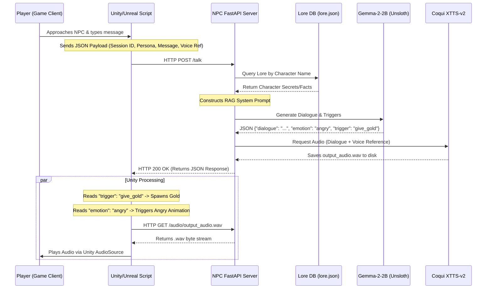

# System Architecture

The Game NPC Engine is designed with a strict separation of concerns. Game Engines (Unity/Unreal/Godot) handle rendering and gameplay logic, while a lightweight, local Python REST API handles all the heavy AI processing (Text generation, RAG, Voice Cloning).

## System Flow Diagram

## Core Components

1. **The Game Client (C# / C++)**
   - Completely decoupled from Python or AI libraries. It only knows how to make HTTP requests and parse JSON/Audio. This ensures zero performance impact on the game's rendering thread.

2. **The FastAPI Router (`npc_api.py`)**
   - The central orchestrator. It holds the LLM and TTS models in VRAM so they remain "hot" and instantly responsive.
   - Manages **Persistent Memory**: It stores a dictionary of `session_id`s so the Unity client doesn't need to transmit the entire chat history every frame.

3. **The LLM Engine (Gemma-2-2B)**
   - Loaded in 4-bit quantization using Unsloth.
   - Trained specifically to output strict JSON containing `dialogue`, `emotion`, and gameplay `trigger` events.

4. **The RAG / Lore Engine**
   - A fast, silent injection layer. Before the LLM processes the prompt, the API injects contextual "facts" from `lore.json` to prevent hallucination.

5. **The TTS Engine (Coqui XTTS-v2)**
   - Operates entirely locally. It takes the text outputted by the LLM and a 3-second reference `.wav` file, and clones the voice zero-shot.
